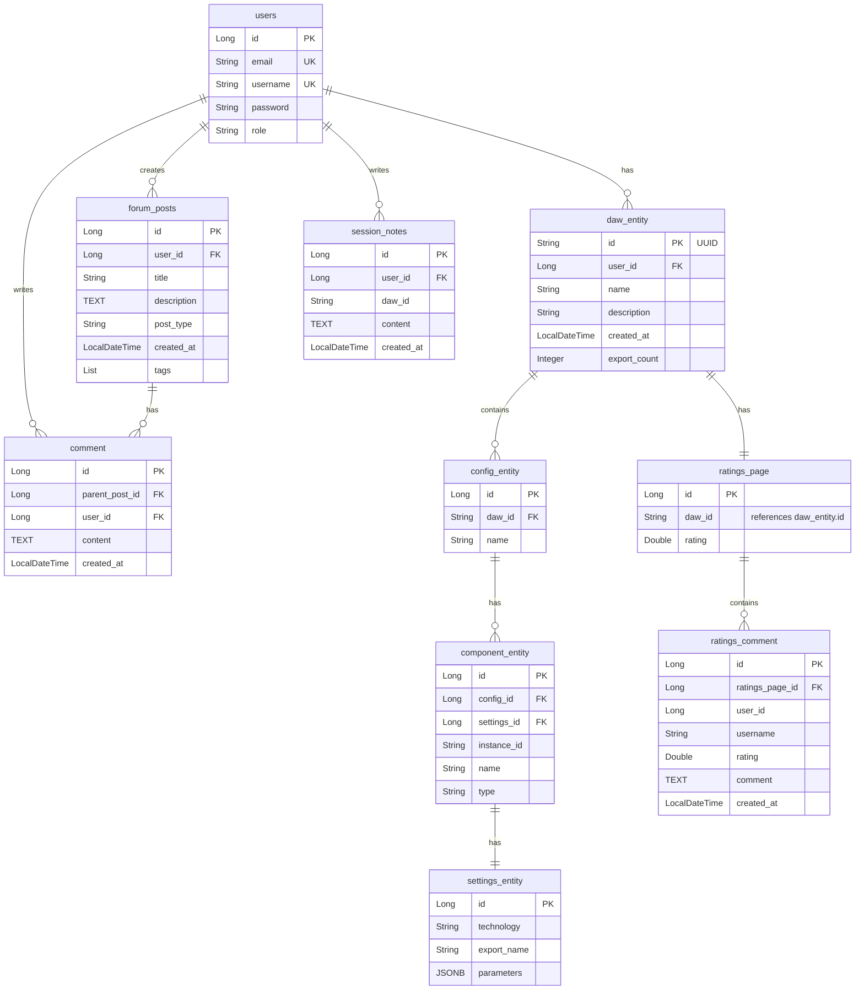

# Project Name

## Table of Contents
- [Setup Instructions](#setup-instructions)
- [Purpose of Project](#purpose-of-project)
- [Developer Documentation](#developer-documentation)
- [Frontend Documentation](#frontend-documentation)

---

## Setup Instructions

### Prerequisites

Before running the application, ensure you have Docker Desktop installed.

### Docker Compose Setup

#### Step 1: Start All Services

From the project root directory, run:

```bash
docker-compose up --build
```

This command will:
- Build the backend (Spring Boot) Docker image
- Build the frontend (React/Vite) Docker image
- Start PostgreSQL database
- Start Kafka and Zookeeper
- Start all services in the correct order (with health checks)

#### Step 2: Verify Services Are Running

Once the containers are up, you should see:
- **Database**: Running on `localhost:5432`
- **Backend API**: Running on `http://localhost:8080`
- **Frontend**: Running on `http://localhost:5173`
- **Kafka**: Running on `localhost:9092`

#### Step 3: Access the Application

Open your browser and navigate to:
```
http://localhost:5173
```

#### Additional Docker Commands

**Stop all services:**
```bash
docker-compose down
```

**Stop and remove volumes (clean slate):**
```bash
docker-compose down -v
```

**View logs:**
```bash
# All services
docker-compose logs -f

# Specific service
docker logs dawker-backend -f
docker logs dawker-frontend -f
docker logs dawker-db -f
```

**Rebuild after code changes:**
```bash
docker-compose up --build
```

### Environment Variables

The following environment variables are configured in `docker-compose.yml`:

**Database (PostgreSQL):**
- `POSTGRES_USER`: user
- `POSTGRES_PASSWORD`: password
- `POSTGRES_DB`: dawker_db

**Backend (Spring Boot):**
- `SPRING_DATASOURCE_URL`: jdbc:postgresql://db:5432/dawker_db
- `SPRING_DATASOURCE_USERNAME`: user
- `SPRING_DATASOURCE_PASSWORD`: password
- `SPRING_KAFKA_BOOTSTRAP_SERVERS`: kafka:29092

**Frontend (React):**
- `REACT_APP_API_URL`: http://localhost:8080/

### Troubleshooting

**Port Already in Use:**
```bash
# Stop all containers
docker-compose down

# Or stop specific service
docker stop dawker-backend
```

**Database Connection Issues:**
1. Check that the `db` service is healthy: `docker ps`
2. Verify the database is ready: `docker logs dawker-db`
3. Check `application.properties` matches docker-compose environment variables

**Frontend Can't Reach Backend:**
- The frontend is configured to call `http://localhost:8080/api`
- Check the `REACT_APP_API_URL` environment variable in `docker-compose.yml`
- Ensure backend service is healthy before frontend starts

---

## Purpose of Project

DAWker is a web-based Digital Audio Workstation (DAW) application designed for guitarists who want to share their setups with each other. It provides real-time audio processing, preset management, and a community platform for sharing and discovering guitar amp configurations.

We sought to create a way for guitarists or just audio enthusiasts to not only have easy access to a free DAW, but we wanted to build a community around it using the social media feature, users can interact, share their progress, their DAWs and enjoy a community of like-minded individuals.

### Functionality

**Core Features:**

1. **Real-Time Audio Processing**
   - Browser-based guitar amp simulation using native Web Audio API
   - Support for RNBO (Max/MSP) audio patches for advanced effects
   - Real-time audio input processing from microphones or audio interfaces
   - Low-latency audio processing for live performance

2. **Preset Management**
   - Create and save custom DAW configurations (presets)
   - Organize presets with multiple configurations per DAW
   - Component-based signal chain system (amps, pedals, cabinets, effects)
   - Save and load complete DAW states with all settings

3. **Audio Component System**
   - Modular component architecture (Input Gain, Distortion, EQ, Reverb, etc.)
   - Configurable parameters for each component
   - Support for multiple technologies (Native Web Audio API, RNBO, Tone.js)
   - Chain multiple effects together in custom configurations

4. **User Accounts & Authentication**
   - User registration and login system
   - User profiles with personal preset collections
   - Secure session management

5. **Search & Discovery**
   - Search all public DAW presets
   - Filter presets by user (view only your own or all)
   - View detailed preset information including component chains
   - Browse community-created presets

6. **Community Features**
   - Forums for discussions (conversations, collaborations, help)
   - Create and respond to forum posts
   - Rating system for presets (1-5 stars)
   - Comments and feedback on presets
   - View ratings and comments on any preset

7. **Preset Sharing**
   - Public presets visible to all users
   - Private presets for personal use
   - Share configurations with the community

### User Stories

- As a **guitarist**, I want to **create and save custom amp presets** so that I can **quickly recall my favorite tones for different songs or performances**

- As a **musician**, I want to **process my guitar in real-time through the browser** so that I can **practice and perform without expensive hardware**

- As a **user**, I want to **search for presets created by other users** so that I can **discover new tones and learn from the community**

- As a **guitarist**, I want to **chain multiple effects together (distortion, EQ, reverb)** so that I can **create complex signal chains like a physical pedalboard**

- As a **user**, I want to **rate and comment on presets** so that I can **provide feedback and help others find quality configurations**

- As a **musician**, I want to **save my DAW state with all settings** so that I can **resume my work exactly where I left off**

- As a **community member**, I want to **participate in forums** so that I can **ask questions, share tips, and collaborate with other musicians**

- As a **user**, I want to **view detailed information about presets** so that I can **understand the component chain and settings before loading them**

- As a **guitarist**, I want to **adjust real-time audio parameters** so that I can **fine-tune my tone while playing**

- As a **user**, I want to **organize my presets into multiple configurations** so that I can **have different setups for different musical styles or projects**

---

## Developer Documentation

### Backend

#### Services

The backend is organized into multiple service layers, each handling specific domain logic. All endpoints are prefixed with `/api`.

##### DAW Service (`dawController`)

Handles Digital Audio Workstation (DAW) operations including creation, retrieval, and saving of DAW configurations.

**Endpoints:**

- `GET /api/search/users?userId={id}` - Get all DAWs for a specific user
- `GET /api/search/daw?dawId={id}` - Get a specific DAW by ID with full details (configs, components, settings)
- `GET /api/search/allDaws` - Get all DAWs in the system
- `POST /api/create/daw?userId={id}&dawName={name}` - Create an empty DAW for a user
- `POST /api/save/Daw` - Save or update a complete DAW (handles both create and update operations)

##### User Service (`dawController` - User endpoints)

Manages user authentication, registration, and profile operations.

**Endpoints:**

- `GET /api/search/allUsers` - Get all users in the system
- `GET /api/search/User?Id={id}` - Get a specific user by ID
- `POST /api/User/auth` - Authenticate user login (email and password)
- `POST /api/User/register` - Register a new user account
- `PUT /api/User/update` - Update user profile information
- `DELETE /api/User/{id}` - Delete a user account

##### Forum Service (`dawController` - Forum endpoints)

Manages community forum posts and comments.

**Endpoints:**

- `GET /api/search/allForums` - Get all forum posts
- `GET /api/search/Forums?Id={id}` - Get a specific forum post by ID
- `GET /api/search/Forums/User?Id={id}` - Get all forum posts by a specific user
- `POST /api/saveForum` - Create a new forum post
- `POST /api/saveComment` - Add a comment to a forum post

##### Ratings Service (`dawController` - Ratings endpoints)

Handles ratings and comments on DAW presets.

**Endpoints:**

- `GET /api/search/ratingsPage?dawId={id}` - Get ratings page for a specific DAW
- `GET /api/search/allRatingsPagesRepo` - Get all ratings pages (debug endpoint)
- `GET /api/search/allRatingsCommentsRepo` - Get all ratings comments (debug endpoint)
- `POST /api/ratings/create` - Create a new rating and comment for a DAW

##### Session Notes Service (`dawController` - Notes endpoints)

Manages user session notes for DAW configurations.

**Endpoints:**

- `GET /api/search/note?Id={id}` - Get a specific session note by ID
- `GET /api/search/note/User?Id={id}` - Get all session notes for a user
- `POST /api/notes/create` - Create or update a session note

#### API Documentation

All endpoints support CORS from `http://localhost:5173` for frontend integration.

**Base URL:** `http://localhost:8080/api`

**Response Formats:**
- Success responses return appropriate HTTP status codes (200, 201, etc.)
- Error responses return 400, 401, 404, or 500 with error details
- All responses are in JSON format

#### Packages

The backend follows a layered architecture pattern:

```
com.project.dawker
├── controller/          # REST API endpoints
│   ├── dawController.java      # Main DAW, User, Forum, Ratings endpoints
│   ├── UserController.java     # Additional user management
│   ├── PresetController.java    # Preset management (legacy)
│   └── ...
├── service/             # Business logic layer
│   ├── DawService.java          # DAW business logic
│   ├── useService.java          # User authentication & management
│   ├── forumService.java         # Forum operations
│   ├── RatingsPageService.java  # Ratings & comments
│   └── ...
├── repository/         # Data access layer (Spring Data JPA)
│   ├── DawRepository.java
│   ├── UserRepository.java
│   ├── ConfigRepository.java
│   ├── ComponentRepository.java
│   └── ...
├── entity/             # JPA entities (database models)
│   ├── User.java
│   ├── daw_specific/
│   │   ├── DawEntity.java
│   │   ├── ConfigEntity.java
│   │   ├── ComponentEntity.java
│   │   ├── SettingsEntity.java
│   │   ├── ForumPost.java
│   │   ├── Comment.java
│   │   ├── RatingsPage.java
│   │   └── ...
│   └── ...
├── dto/                # Data Transfer Objects
│   ├── dawDTO.java
│   ├── configDTO.java
│   ├── componentDTO.java
│   ├── settingsDTO.java
│   ├── userDTO.java
│   └── recievedDto/    # DTOs for incoming requests
│       └── ...
├── exception/          # Custom exception handling
│   ├── GlobalExceptionHandler.java
│   ├── dawNotFoundException.java
│   └── ...
└── config/             # Configuration classes
    └── DataSeeder.java  # Database seeding
```

#### Database

**Database Type:** PostgreSQL 15

**Connection Details:**
- Host: `db` (Docker service name) / `localhost:5432` (local)
- Database: `dawker_db`
- Username: `user`
- Password: `password`

**Schema Overview:**

The database follows a hierarchical structure for DAW management:

**Core Tables:**

1. **users** - User accounts
   - `id` (PK, Long)
   - `email` (String, unique)
   - `username` (String, unique)
   - `password` (String)
   - `role` (String)

2. **daw_entity** - Top-level DAW projects
   - `id` (PK, UUID)
   - `user_id` (FK → users.id)
   - `name` (String)
   - `description` (String)
   - `created_at` (LocalDateTime)
   - `export_count` (Integer)

3. **config_entity** - DAW configurations (signal chains)
   - `id` (PK, Long)
   - `daw_id` (FK → daw_entity.id)
   - `name` (String)

4. **component_entity** - Audio components in a configuration
   - `id` (PK, Long)
   - `config_id` (FK → config_entity.id)
   - `settings_id` (FK → settings_entity.id)
   - `instance_id` (String)
   - `name` (String)
   - `type` (String) - e.g., "distortion", "reverb", "eq"

5. **settings_entity** - Component settings (stored as JSONB)
   - `id` (PK, Long)
   - `technology` (String) - e.g., "RNBO", "TONEJS", "NATIVE"
   - `export_name` (String)
   - `parameters` (JSONB) - Flexible key-value pairs for component parameters

6. **forum_posts** - Community forum posts
   - `id` (PK, Long)
   - `user_id` (FK → users.id)
   - `title` (String)
   - `description` (TEXT)
   - `post_type` (String) - e.g., "convo", "collab", "Help"
   - `created_at` (LocalDateTime)
   - `tags` (ElementCollection)

7. **comment** - Forum post comments
   - `id` (PK, Long)
   - `parent_post_id` (FK → forum_posts.id)
   - `user_id` (FK → users.id)
   - `content` (TEXT)
   - `created_at` (LocalDateTime)

8. **ratings_page** - Ratings aggregation for DAWs
   - `id` (PK, Long)
   - `daw_id` (String, references daw_entity.id)
   - `rating` (Double) - Average rating

9. **ratings_comment** - Individual rating comments
   - `id` (PK, Long)
   - `ratings_page_id` (FK → ratings_page.id)
   - `user_id` (Long)
   - `username` (String)
   - `rating` (Double)
   - `comment` (TEXT)
   - `created_at` (LocalDateTime)

10. **session_notes** - User notes for DAW sessions
    - `id` (PK, Long)
    - `user_id` (FK → users.id)
    - `daw_id` (String)
    - `content` (TEXT)
    - `created_at` (LocalDateTime)

**Relationships:**

- **User → DAW**: One-to-Many (one user can have many DAWs)
- **DAW → Config**: One-to-Many (one DAW can have many configurations)
- **Config → Component**: One-to-Many (one config can have many components, ordered by `chain_order`)
- **Component → Settings**: One-to-One (each component has one settings entity)
- **User → ForumPost**: One-to-Many (one user can create many forum posts)
- **ForumPost → Comment**: One-to-Many (one post can have many comments)
- **DAW → RatingsPage**: One-to-One (each DAW has one ratings page)
- **RatingsPage → RatingsComment**: One-to-Many (one ratings page has many comments)

**Key Features:**

- **JSONB Storage**: Component parameters are stored as JSONB in PostgreSQL, allowing flexible schema for different component types
- **Ordered Components**: Components maintain order via `@OrderColumn` annotation for signal chain ordering
- **Cascade Operations**: Deleting a DAW cascades to configs, components, and settings
- **UUID for DAWs**: DAW entities use UUID for globally unique identifiers

**ERD:**

The following Entity Relationship Diagram shows the database structure:



**Note:** If the Mermaid diagram doesn't render in your markdown viewer, you can:
1. Use GitHub/GitLab (they support Mermaid natively)
2. Use an online Mermaid editor: https://mermaid.live/
3. Export as PNG/SVG and embed the image instead

**Sample Queries:**

```sql
-- Get all DAWs for a user
SELECT * FROM daw_entity WHERE user_id = 1;

-- Get full DAW with configs and components
SELECT d.*, c.*, comp.*, s.*
FROM daw_entity d
LEFT JOIN config_entity c ON c.daw_id = d.id
LEFT JOIN component_entity comp ON comp.config_id = c.id
LEFT JOIN settings_entity s ON s.id = comp.settings_id
WHERE d.id = 'some-uuid';

-- Get forum posts with comment counts
SELECT fp.*, COUNT(c.id) as comment_count
FROM forum_posts fp
LEFT JOIN comment c ON c.parent_post_id = fp.id
GROUP BY fp.id;
```

---

## Frontend Documentation

### Libraries

#### Tailwind CSS

**Purpose:**

**Configuration:**

#### Blueprint

**Purpose:**

**Usage:**

### React

**Version:**

**Key Components:**

```
src/
├── components/
├── pages/
├── services/
├── utils/
└── styles/
```

**Routing:**

**State Management:**

---

## Additional Resources

### Wireframes

[Link to wireframes or embed images]

### Architecture Diagram

[Link to architecture diagram or embed image]
